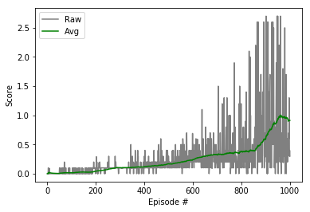

# Deep RL Nanodegree - Report for Project 3
In this project, an agent is trained in the [Tennis](https://github.com/Unity-Technologies/ml-agents/blob/master/docs/Learning-Environment-Examples.md#tennis) environment. The goal is to train two agents to play tennis against each other. Please refer to the [Readme](README.md) for more details.

## Learning Algorithm
In order to solve this problem, [DDPG](https://arxiv.org/abs/1509.02971) is used. DDPG is an adaptation of the successful Deep Q-Learning [DQN](https://storage.googleapis.com/deepmind-media/dqn/DQNNaturePaper.pdf) to the continuous action domain. The algorithm is model-free and based on the [deterministic policy gradient](http://proceedings.mlr.press/v32/silver14.pdf); it leverages a actor-critic setup and is designed for continuous action spaces. Since the environment requires two agents that play against each other, two DDPG agents are trained simultaneously by self-play. Each agent has the same memory replay buffer with experiences containing states, actions, rewards and next states of both agents.  

## Network Architechture
The actor and critic are both represented as fully-connected neural networks. 

The network for the actor consists of a 48-dimensional input layer corresponding to the state size (24) multiplied by the number of agents (2), two hidden layers with 256 and 128 nodes and a 2-dimensional output layer corresponding to the action size. For more robust training there is also a batch norm layer after the first fully connected layer.

The network for the critic consists of a 48-dimensional input layer corresponding to the state size (24) multiplied by the number of agents (2), two hidden layers with 256, and 128 nodes and a 1-dimensional output layer corresponding to the Q-value prediction. The actions of both agents are added as input at the first hidden layer by concatenation. For more robust training there is also a batch norm layer after the first fully connected layer.


## Training Details
The following hyper-parameters were used. 

```python
BUFFER_SIZE = int(1e6)  # replay buffer size
BATCH_SIZE = 128        # minibatch size
GAMMA = 0.99            # discount factor
TAU = 8e-2              # for soft update of target parameters
LR_ACTOR = 1e-3         # learning rate of the actor 
LR_CRITIC = 1e-3        # learning rate of the critic
WEIGHT_DECAY = 0.0      # L2 weight decay
UPDATE_STEP = 1         # Step size for updating the networks
UPDATE_ITER = 1         # Number of updates per step
```

## Plot of Rewards



## Importance of Exploration
Since there are two agents involved the training process is even more unstable than regular RL. Initially, the agents would not converge regardless of network architecture and extensive hyper-parameter search. I noticed that it is crucial to explore some experiences with a positive reward early on to allow the agents to learn a good policy. Therefore, I spend a lot of time to come up with a good exploration schedule. I extended the exploration methodology that I implemented in the previous project. In order to facilitate a gradual transition from acting in the environment by exploration to acting based on the policy, the exploration probability is determined based on the progress of training: 
```python
p = np.clip(1 - np.sqrt(i_episode/noise_episodes), 0, 1)
```
Based on this probability, exploration noise can be added in three different ways, *fuse*, *threshold* or *add*.  In the option *fuse* the exploration noise is fused with an action from the policy proportional to the probability. In the option *threshold* the probability is used as a threshold to either sample an action from the policy or use the exploration noise directly. In the option *add*, the exploration noise is simply added to the policy action. In the experiments, using the [OU process](https://en.wikipedia.org/wiki/Ornstein%E2%80%93Uhlenbeck_process) as noise source and adding the exploration noise to the policy action worked the best. The implementation is shown below.
```python
if noise_apply == 'fuse':
    if noise_type == 'ou':
        action = (1-noise_prob) * action + (noise_prob) * noise_scale * self.ou_noise.sample()
    elif noise_type == 'uni':
        action = (1-noise_prob) * action + (noise_prob) * noise_scale * self.uni_noise.sample()
elif noise_apply == 'thres':
    if noise_type == 'ou' and noise_prob > random.random():
        action = noise_scale*self.ou_noise.sample()
    elif noise_type == 'uni' and noise_prob > random.random():
        action = noise_scale*self.uni_noise.sample()
elif noise_apply == 'add':
    if noise_type == 'ou':
        action += noise_scale*noise_prob * self.ou_noise.sample()
    elif noise_type == 'uni' and noise_prob > random.random():
        action += noise_scale*noise_prob * self.uni_noise.sample()        
elif noise_apply == None:
    pass
else:
    print('Invalid Noise Type!')
```

## Future Work
### Improved version of DDPG

When training the the agent, it became apparent that it is quite sensitive to the network architecture (actor and critic) and training parameters. While the current agent learns to solve the task quite quickly, further performance boost could certainly be achieved by further hyper-parameter tuning. 

Also, [prioritized experience replay](https://arxiv.org/abs/1511.05952) could help to further boost performance. In conventional DDPG experiences are samples from the replay memory proportional to the frequency they occurred. Priority experience replay, as the name suggests, prioritizes experiences containing important transitions and samples them more frequently. This leads to more efficient training.

### Soccer Environment

It would be a nice challenge to solve the more difficult **Soccer** environment.

![Soccer][image2]

In this environment, the goal is to train a team of agents to play soccer.  

You can read more about this environment in the ML-Agents GitHub [here](https://github.com/Unity-Technologies/ml-agents/blob/master/docs/Learning-Environment-Examples.md#soccer-twos).  To solve this harder task, you'll need to download a new Unity environment.  (**Note**: Udacity students should not submit a project with this new environment.)

You need only select the environment that matches your operating system:
- Linux: [click here](https://s3-us-west-1.amazonaws.com/udacity-drlnd/P3/Soccer/Soccer_Linux.zip)
- Mac OSX: [click here](https://s3-us-west-1.amazonaws.com/udacity-drlnd/P3/Soccer/Soccer.app.zip)
- Windows (32-bit): [click here](https://s3-us-west-1.amazonaws.com/udacity-drlnd/P3/Soccer/Soccer_Windows_x86.zip)
- Windows (64-bit): [click here](https://s3-us-west-1.amazonaws.com/udacity-drlnd/P3/Soccer/Soccer_Windows_x86_64.zip)

Then, place the file in the source folder of the GitHub repository, and unzip (or decompress) the file.  Next, open `Soccer.ipynb` and follow the instructions to learn how to use the Python API to control the agent.

(_For AWS_) If you'd like to train the agents on AWS (and have not [enabled a virtual screen](https://github.com/Unity-Technologies/ml-agents/blob/master/docs/Training-on-Amazon-Web-Service.md)), then please use [this link](https://s3-us-west-1.amazonaws.com/udacity-drlnd/P3/Soccer/Soccer_Linux_NoVis.zip) to obtain the "headless" version of the environment.  You will **not** be able to watch the agents without enabling a virtual screen, but you will be able to train the agents.  (_To watch the agents, you should follow the instructions to [enable a virtual screen](https://github.com/Unity-Technologies/ml-agents/blob/master/docs/Training-on-Amazon-Web-Service.md), and then download the environment for the **Linux** operating system above._)